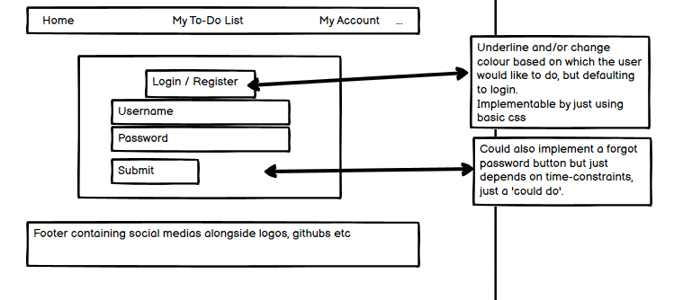
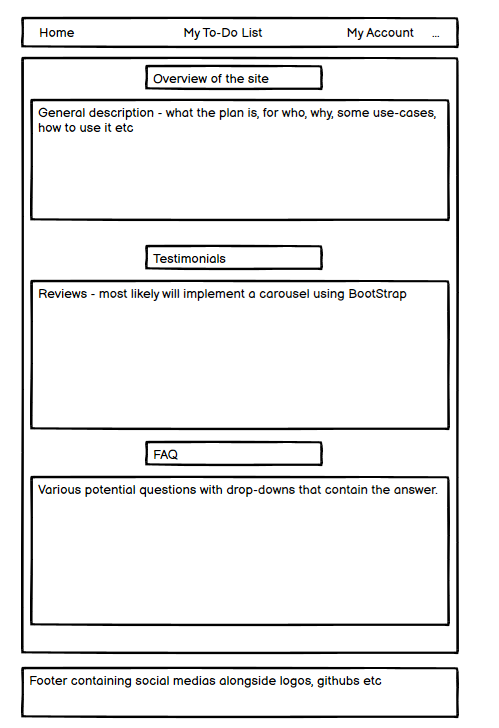
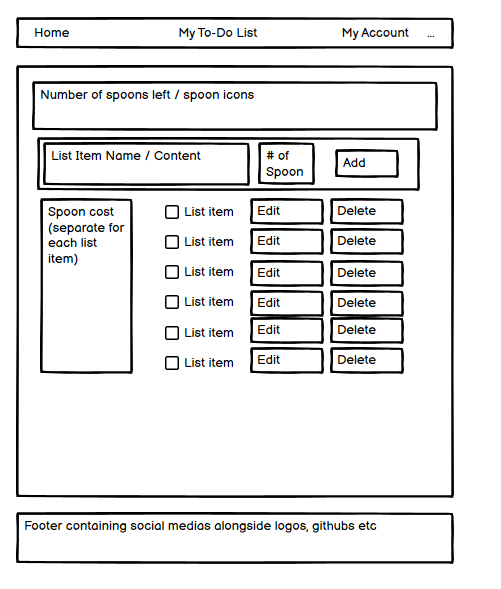
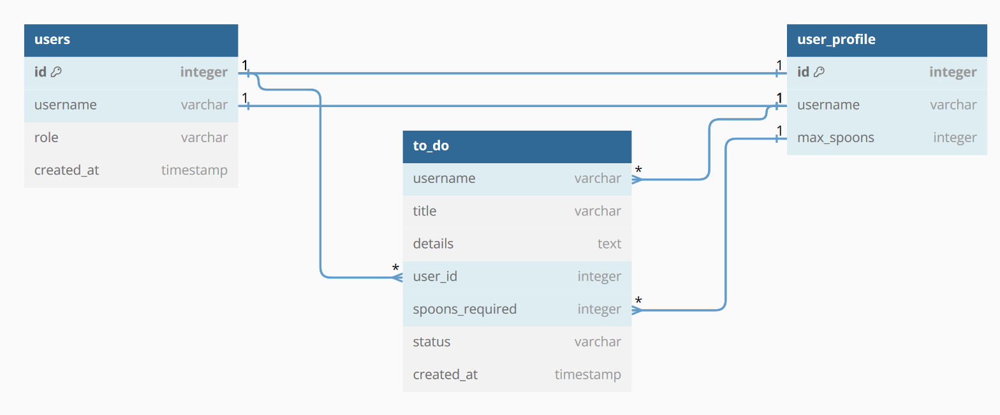
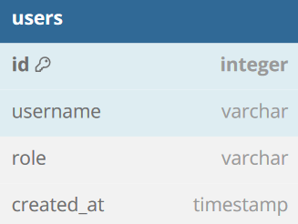
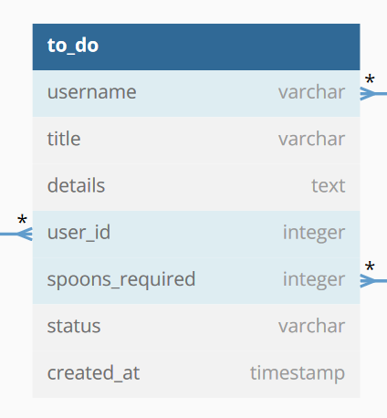
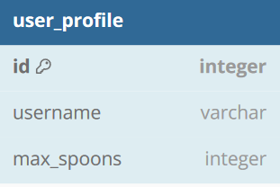
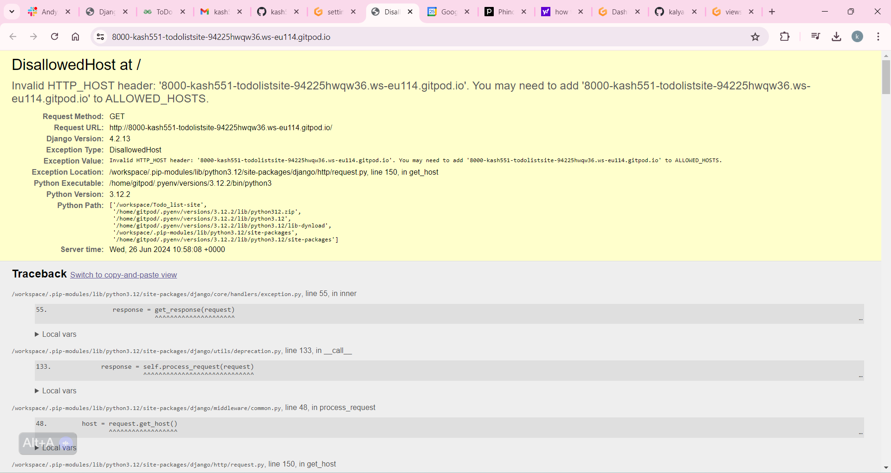
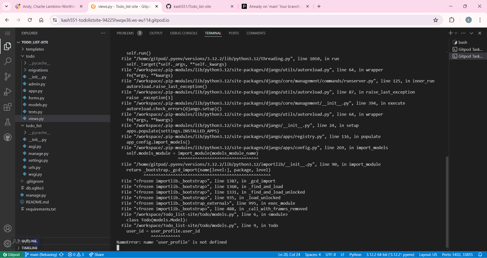

<h1 align='center'>ToDo List</h1>

# About
 
Our to-do list app is designed to empower individuals living with chronic conditions by integrating the Spoon Theory into daily planning. By tracking the expenditure of "spoons" (a metaphor for energy), users can effectively plan their day around their average amount of spoons, ensuring they allocate their energy wisely across various tasks.
       
      Key features include:
       
      <ul>
        <li>Customizable Spoon Allocation: Users can assign a specific number of spoons to each task, reflecting the unique energy requirements of their daily activities.</li>
        <li>Visual Energy Tracking: An intuitive interface displays the remaining spoons after each task, providing real-time insights into energy management.</li>
        <li>Future Planning: Users can schedule tasks for future dates, allowing for long-term planning and anticipation of energy needs.</li>
      </ul>
      Designed with simplicity and ease of use in mind, our app aims to reduce the mental load associated with energy management, enabling individuals to focus on what matters most. Whether you're new to the Spoon Theory or an experienced practitioner, our app offers tools to enhance your daily routine and support a healthier, more balanced lifestyle.
      

# UX
## User Stories

As a user I would like to be able to create my own personal tasks.
Acceptance criteria:
<ul>
<li>Ability to create a task</li>
<li>Contains: title, details, spoons required, status and date created.</li>
</ul>
As a user I would like to be able to delete tasks that I have created.
Acceptance criteria:
<ul>
<li>Ability to delete a task from as a user</li>
<li>Deleted tasks removed from database</li>
</ul>
As a user I would like to visibly see that my task has been completed.
Acceptance criteria:
<ul>
<li>Ability to see completed tasks</li>
<li>Completed tasks remain in the database</li>
</ul>
As a user I would like to see when my task is due and set my own date.
Acceptance criteria:
<ul>
<li>Ability to see when task is due</li>
<li>Ability to set due date</li>
</ul>
As a user I would like to be able to create my own account.
Acceptance criteria:
<ul>
<li>Ability to create an account which gets saved in the database so that I can login as me again later.</li>
<li>Ability to set my average number of daily spoons</li>
</ul>
As a user I would like to be able to view all my personal tasks that I have set.
Acceptance criteria:
<ul>
<li>Ability to see all my tasks when logged in.</li>
</ul>
As a user I would like to know how many spoons I have left after fulfilling daily tasks.
Acceptance criteria:
<ul>
<li>Ability to see how many spoons I have left for the day.</li>
<li>Spoons remaining reduces by the increment of tasks completed that day</li>
<li>Spoons resets each day</li>
</ul>
As a user I would like to be able to set how many spoons a task takes to complete
Acceptance criteria:
<ul>
<li>Ability to set how many spoons a task will require.</li>
<li>Spoons remaining reduces by the increment of tasks as they are set to complete</li>
</ul>

# Scope
## **Features**
### **Home page**
### **Login/Register page**

# Wireframes

 Wireframe for login/register page 

</img>
 

 Wireframe for Index page 

</img>
 

 Wireframe for My To-Do List page 

</img>

# Database schema
</img>
Using DBDiagram.io, we were able to effectively map out the relationships between various database entities, which significantly enhanced our understanding of how these entities interact within the system. This tool allowed us to visually represent the connections between different tables through the use of arrows, indicating the direction and nature of the relationships. By doing so, it became much clearer how data flows from one table to another, facilitating a more intuitive grasp of the overall database structure.

## Models
### **User Model** 

</img>

### **To_do Model**
</img>

### **user_profile Model**

</img>

# Technologies Used
## Languages

- [HTML5](https://en.wikipedia.org/wiki/HTML5)
- [CSS3](https://en.wikipedia.org/wiki/CSS)
- [Python](https://www.python.org/)

## Frameworks, Libraries & Programs Used

[GitHub](https://github.com/) - Holds the repository of my project, GitHub connects to GitPod and Heroku.
[GitPod](https://gitpod.io/workspaces) – Connected to GitHub, GitPod hosted the coding space, allowing the project to be built and then committed to the GitHub repository. 

[Heroku](https://www.heroku.com/) - Connected to the GitHub repository, Heroku is a cloud application platform used to deploy this project so the backend language can be utilised/tested. 

[Django](https://www.djangoproject.com/) - This framework was used to build the foundations of this project

[Gunicorn](https://gunicorn.org/) - Gunicorn is a pure-Python HTTP server for WSGI applications.
[Dj Database URL](https://pypi.org/project/dj-database-url/) - This allows you to utilize the 12factor inspired DATABASE_URL environment variable to configure your Django application.

[Bootstrap](https://getbootstrap.com/) - Used to quickly add design to my website, Bootstrap focuses on mobile first design meaning this website is responsive across multiple devices ans screen sizes. 

[Summernote](https://summernote.org/) Used to add a text area field to the admin setup to enable a list of tasks.

[Google Fonts](https://fonts.google.com/https://fonts.google.com/) - provide fonts for the website.

[Font Awesome](https://fontawesome.com/) -was used for icons.

[Balsamiq](https://balsamiq.com/) - was used to create site wireframes.

[Am I Responsive](http://ami.responsivedesign.is/) - to check if the site is responsive on different screen sizes.

[W3C Markup Validator](https://validator.w3.org/#validate_by_input) - was used to validate HTML

[W3C CSS Validator](https://jigsaw.w3.org/css-validator/) - was used to validate CSS

[Beautify](https://www.jpkc.com/tools/beautify/) - was used to correct indentation issues and get rid of too much whitespace - HTML, CSS

[Coolors](https://coolors.co/9df57a-3c444c-fee73b-ff4f98-2daaf3-a9bedb) - to make color palette

# Testing
## User Story Testing
## Bugs and Issues

The diallowed host errors below were fixed easily by adding the 8000 port to allowed hosts to the settings.py file and commiting it to the main.

</img>

We had a couple of issues at the start to multiple people working on main at the same time, but we figured that out early and moved to seperate branches.

 Log error with heroku saying  NameError: name 'user_profile' is not defined, having googled the error we discovered it was either a spelling error or a ordering issue in the models.py file, having checked the spelling and moved the UserProfile model to the top the error message disappeared.

 ImportError: cannot import name 'Todo' from 'todo.models' (/tmp/build_981df2ca/todo/models.py). Did you mean: 'ToDo'? Implementing the suggested change to ToDo fixed this error

To fix the error below we removed a duplicate Todo model which must have come from a merge issue and added a userprofileform to forms.py

</img>

# Deployment
This project was deployed using Github and Heroku.

## Github
To create a new repository I took the following steps:

- Logged into Github.
- Clicked over to the ‘repositories’ section.
- Clicked the green ‘new’ button. This takes you to the create new repository page.
- Once there under ‘repository template’ I chose the code institute template from the dropdown menu.
- I input a repository name then clicked the green ‘create repository button’ at the bottom of the page.
- Once created I opened the new repository and clicked the green ‘Gitpod’ button to create a workspace in Gitpod for editing.

## Django and Heroku 
- To get the Django framework installed and set up I followed the Code institutes [Django Blog cheatsheet](https://codeinstitute.s3.amazonaws.com/fst/Django%20Blog%20Cheat%20Sheet%20v1.pdf)

# Credits
<h3>content</h3>
<ul>
<li>The icons for the social media buttons were sourced from Font Awesome.</li>
<li>Some of  the content was sourced using sourced using chatgpt and Phind.com.</li>
<li>Content information taken from the websites linked below:
<ul>
<li>https://cdn.totalcomputersusa.com/butyoudontlooksick.com/uploads/2010/02/BYDLS-TheSpoonTheory.pdf</li>
<li>https://www.healthline.com/health/spoon-theory-chronic-illness-explained-like-never-before#1</li>
</ul>
<li>Instructions and inspiration on how to implement a TO-Do List python webapp instructions by geeksforgeeks, linked below:
https://www.geeksforgeeks.org/python-todo-webapp-using-django/</li>
<li>inspiration for how to use allauth to create a user registration form was taken from crunchydata's blog and Django Login, Logout, Signup, Password Change, and Password Reset
By Will Vincent linked below:
<ul>
<li>https://www.crunchydata.com/blog/building-a-user-registration-form-with-djangos-built-in-authentication</li>
<li>https://learndjango.com/tutorials/django-login-and-logout-tutorial</li></li>
</ul>
</ul>

## Media

<ul>
<li>Linked in the FAQ section is an article on spoons theory called The Spoon Theory
by Christine Miserandino. Linked below:
<ul><li>https://cdn.totalcomputersusa.com/butyoudontlooksick.com/uploads/2010/02/BYDLS-TheSpoonTheory.pdf</li>
</ul>
</ul>

## Acknowledgement
